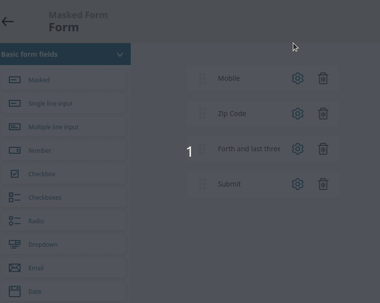

# ezplatform-form-builder-masked-input-field

## Description
Bundle provides masked field for the Form Builder in eZ Platform EE. 
Bundle is based on: https://github.com/RobinHerbots/Inputmask

## Requirements
eZ Platform EE 2.5 LTS

## Installation
### 1. Enable EzPublishLegacyBundle and EzSystemsEzPlatformXmlTextFieldTypeBundle
Edit `app/AppKernel.php`, and add 
```
new MateuszBieniek\EzPlatformFormBuilderMaskedInputBundle\EzPlatformFormBuilderMaskedInputBundle(),
```
at the end of the `$bundles` array.
### 2. Install `mateuszbieniek/ezplatform-form-builder-masked-input-field`
```
composer require mateuszbieniek/ezplatform-form-builder-masked-input-field
```

## Usage
You can define a mask for input using the following wildcards:

`a` - single letter (a-z)
`9` - single digit (0-9)
`*` - single letter or digit

Example phone number mask:
`999-999-999`

You can use any other character as a static part of your mask.

Example phone number mask with static country code:
`+48 999-999-999`

You can escape wildcards with `backslash`.

Example phone number mask with a static country code (Germany):
`+4\9 999-999-999`

You can place optional parts of mask in brackets `[]` they won't be displayed until typed on or "greedy" option checked.

When the masked input field is required, an additional mask validator is used that checks if provided value matches the 
required format.